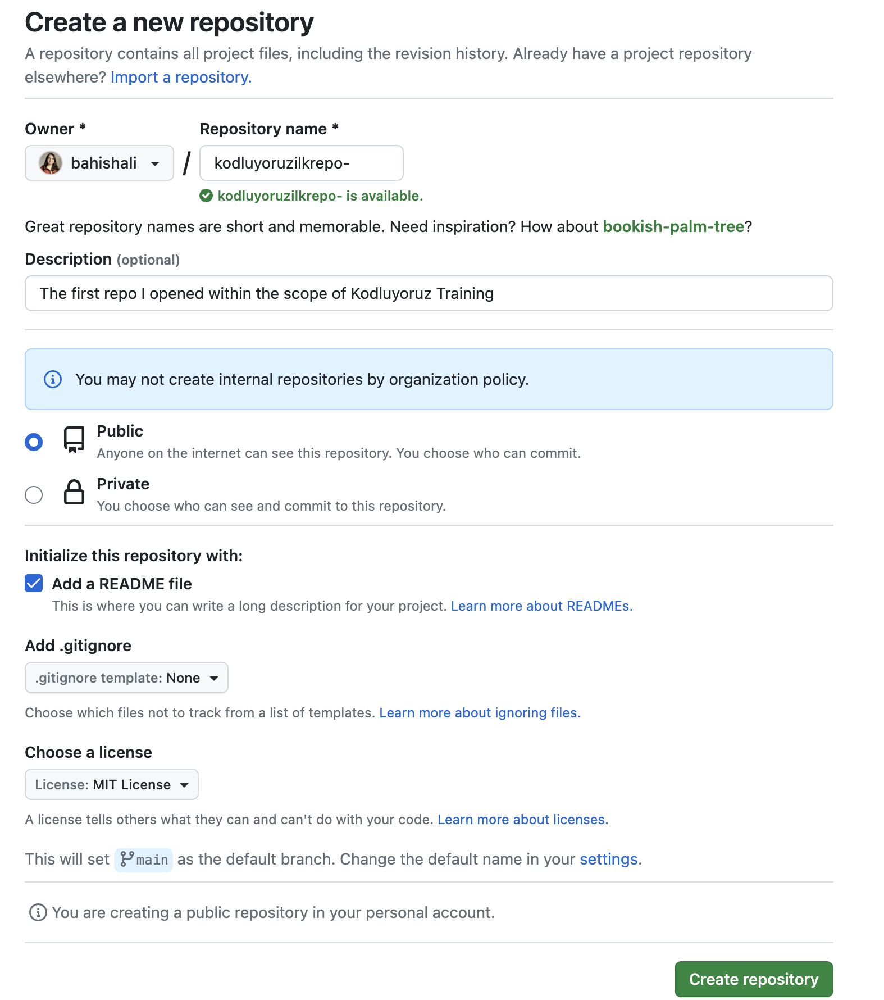

# **Kodluyoruz Ilk Repo**

Bu repo [Kodluyoruz](https://kodluyoruz.org/) Front-End Eğitiminde oluşturduğumuz ilk repo. İçerisinde bir ader README dosyası, bir adet de index.html barındırıyor.



## **Installation**

Öncelikle projeyi clonelayın.

```bash 
git clone https://github.com/bahishali/kodluyoruzilkrepo.git
```

## **Usage**

Projeyi cloneladıktan sonra Visual Studio Code programında açınız.

#### Linux için:

```linux
cd kodluyoruz ilkrepo
code .
```

## **Contributing**

Pull requestler kabul edilir. Büyük değişiklikler için, lütfen önce neyi değiştrimek istediğinizi tarrışmak için bir konu açınız.


## **License**

[MIT](https://choosealicense.com/licenses/mit/)


